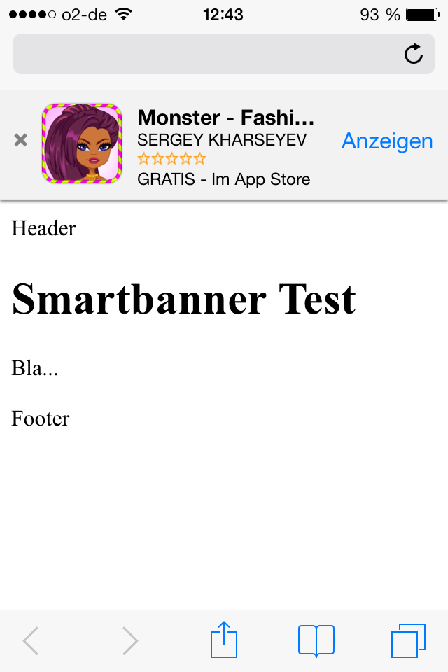
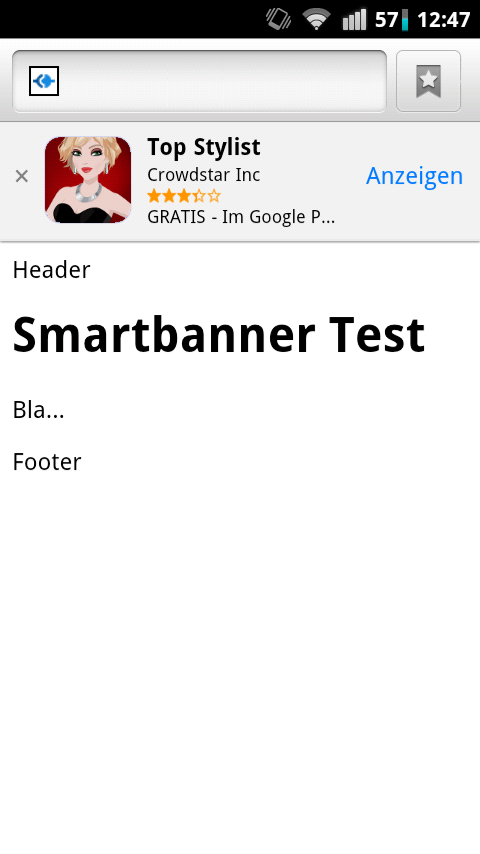
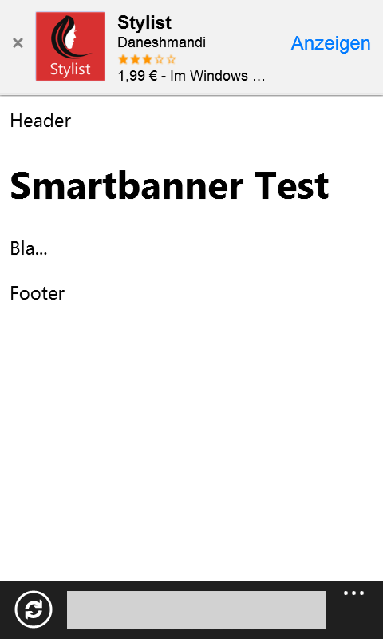

# node-smartbanner

[Smart Banners](http://developer.apple.com/library/ios/#documentation/AppleApplications/Reference/SafariWebContent/PromotingAppswithAppBanners/PromotingAppswithAppBanners.html) are a new feature in iOS 6 to promote apps on the App Store from a website using meta tags.

Sometimes you might want a bit more control on when things get displayed as well as a promotion of your Google Play or Windows Phone App then this express middleware and client script might be useful.

The client side script is currently based on [xui](http://xuijs.com). 
Note: You'll need to run at least node version 0.8.24 (bugfix for https server requests required).

This project is inspired by [jquery.smartbanner](https://github.com/jasny/jquery.smartbanner). Thanks.

## How does it look

<table>
<thead>
	<td>iOs</td>
	<td>Android</td>
	<td>WP</td>
</thead>
<tr>
	<td valign="top">
		
	</td>
	<td valign="top">
		
	</td>
	<td valign="top">
		
	</td>
</tr>
</table>

## How it works

The client side script `xui.smartbanner.js` parses the User-Agent and sends off a request to the node-server running `smartbanner`. From there a backend request is issued to retrieve data from the respective App-Store.
With this data, containing Title, Name, Rating, and Price, the "smartbanner" is returned.

# Usage

On node using express include:

```js
var smartbanner = require('./smartbanner');

...

/**
 * include smartbanner 
 */
app.post('/smartbanner', smartbanner );
```

If you need a different configuration e.g. different language settings, please take a look in `config.js`.

On the bottom of your page which shall contain a smartbanner with the appIds of the different stores:

```html
	<script src="js/xui-2.3.2.js"></script>
	<script src="js/xui.smartbanner.js"></script>
	<script>
	x$().smartbanner({ 
		// add here the appIds of your Apps
		appId: {
			ios: "725989866",
			android: "com.crowdstar.avatar",
			windowsphone: "37527bf3-5820-43e5-9ae3-be310466fea4",
		},
		daysHidden: 0,   // Duration to hide the banner after being closed (0 = always show banner)
		daysReminder: 0, // Duration to hide the banner after "VIEW" is clicked *separate from when the close button is clicked* (0 = always show banner)
		//~ force: 'ios', // 'ios' 'android' 'windowsphone' uncomment to force display
	});
	</script>
```

## Try it

There is a sample app in `test/app`.

```bash
npm install
cd test/app
npm install
node app.js
```

Access it with http://localhost:3000

## Contribution and License Agreement

If you contribute code to this project, you are implicitly allowing your code to be distributed under the MIT license. You are also implicitly verifying that all code is your original work. 

# License

Copyright (c) 2013 Commenthol under [MIT](./LICENSE).

